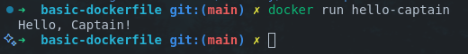

# Basic Dockerfile


> Roadmap.sh Project URL: https://roadmap.sh/projects/basic-dockerfile

## How to run

Clone the repository.

```bash
git clone https://github.com/pasindu-kavinda/devops-projects.git
cd devops-projects/basic-dockerfile
```

> Make sure you have installed [Docker](https://docs.docker.com/).

```bash
docker build -t hello-captain .
```

Run following commands to list your activities.

```bash
docker run hello-captain
```

## Output


