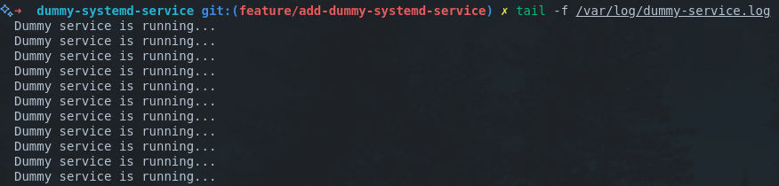

# Dummy Systemd Service


> Roadmap.sh Project URL: https://roadmap.sh/projects/dummy-systemd-service

## How to run

> Make sure you have linux OS.

Clone the repository.
```bash
git clone https://github.com/pasindu-kavinda/devops-projects.git
cd devops-projects/dummy-systemd-service
```

Install the service
```bash
sudo chmod +x install.sh
./install.sh
```

Start the service
```bash
sudo systemctl start dummy
```

Check the logs of the service
```bash
journalctl -u dummy -f

tail -f /var/log/dummy-service.log
```

Other commands
```bash
sudo systemctl stop dummy
sudo systemctl enable dummy
sudo systemctl disable dummy
sudo systemctl status dummy
```

Uninstall the service
```bash
sudo chmod +x uninstall.sh
./uninstall.sh
```

## Output


